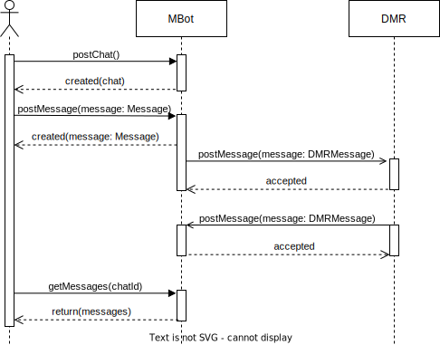

# Mock Bot Technical Architecture

This document outlines the technical design for the mock chatbot component.

## Introduction

Mock Bot is a lightweight component used to demonstrate chatbot integration with a Distributed Message Room.

It has two main responsibilities:
- Enable clients to start chats and send messages;
- Forward client messages to DMR and provide replies to incoming DMR messages.

| Feature                                                                                                                                                                                                                                                                                                                                                                                                                                         | Scope in MVP   |
|:------------------------------------------------------------------------------------------------------------------------------------------------------------------------------------------------------------------------------------------------------------------------------------------------------------------------------------------------------------------------------------------------------------------------------------------------|----------------|
|  Client can start a chat with MBot, post messages to it and see the message history.                                                                                                                                                                                                                                                                                                    | Implementation |
|  Admin can configure chat history limits to avoid MBot message history using too much memory.                                                                                                                                                                                                                                                                                           | Implementation |
|  Clients message is forwarded to DMR due to MBot not understanding it.                                                                                                                                                                                                                                                                                                                       | Implementation |
|  MBot provides a reply to any message forwarded to it by DMR.                                                                                                                                                                                                                                                                                                                                | Implementation |
|  MBot adds DMR reply to clients chat.                                                                                                                                                                                                                                                                                                                                                        | Implementation |
|  Client can continue chatting with the chatbot that provided the reply through DMR.  [?] It was mentioned that when the client continues chatting with an external chatbot, the initial chatbot does not see these messages (or just does not store them?). What happens when the client reloads chat history?                                                                           | Implementation |
|  MBot authenticates itself when communicating with DMR / CentOps.                                                                                                                                                                                                                                                                                                                     | Implementation |
|  MBot encrypts client messages when sending them to DMR so that DMR can not eavesdrop.  [?] Unclassified message is encrypted so Classifier can read it and Classifier re-encrypts according to target bot? When a bot wants to send a message straight to another bot then it encrypts the message for that bot? It was mentioned SNI will be used for this, how will this work? | Implementation |
|  Client can see human readable details about the bot that replied through DMR (name, availability, phone number).                                                                                                                                                                                                                                      | Implementation |
|  Client can forbid MBot from forwarding a message if they do not agree with the classification provided by Classifier.                                                                                                                                                                                                                                                                       | Documentation  |
|  MBot notifies DMR when it does not understand a message routed to it so that the message can be routed to the next best candidate.                                                                                                                                                                                                                                                          | Documentation  |
|  Chatbot replying to a message routed to it through DMR can ask the client to authenticate themselves.                                                                                                                                                                                                                                                                                       | Documentation  |

## Chat mock

Mock Bot has a REST API (`/client-api`) which allows clients to chat with the Mock Bot. This API will be synchronous and return `201 Created` on success for ease of testing. 

Chats are stored in memory and can be configured to clear themselves to avoid taking up too much memory.

## DMR

Mock Bot has a REST API (`/dmr-api`) which will receive messages from DMR. This API will be async and return `202 Accepted` on success.

### Ask for help

Mock Bot will forward any message it does not understand to DMR for help from fellow bots. Since Mock Bot does not understand any client message, all client messages are forwarded to DMR.

### Provide help

Mock Bot will reply to incoming DMR messages according to a hardcoded map of keywords and responses:

| keyword              | response                                                                                                                      |
|----------------------|-------------------------------------------------------------------------------------------------------------------------------|
|                      | ...                                                                                                                           |
| hello                | Hello!                                                                                                                        |
| drivers license      | Your drivers licence has been suspended for reckless driving. For further information please visit https://eteenindus.mnt.ee/ |
| strange lights       | Please visit https://www.politsei.ee/en and select "Apply for alien's passport".                                              |
| pizza with pineapple | To report a crime please visit https://www.politsei.ee/en/report-to-police.                                                   |

## Chatbot stories over DMR

A chatbots answer may be just one step in a multiple step story, e.g. `I want to renew my drivers license` might require the following steps:

1. User authentication
2. Request for an updated document image
3. Request for an updated signature sample
4. Provide delivery information
5. Pay service fees

It is therefore necessary that chat sessions can be started and continued though DMR.

### Requests from CentOps

CentOps notifies Chatbot about changes in the participants of the ecosystem. Initially Chatbot only needs to know about participating DMR-s, but this might
change
once we start encrypting messages between participants (encryption keys might be included in the participant data).

## Hosting

The Mock Bot will be deployed and hosted as a container on a Kubernetes cluster and will follow the foundation design for Kubernetes in terms of
configuration.
